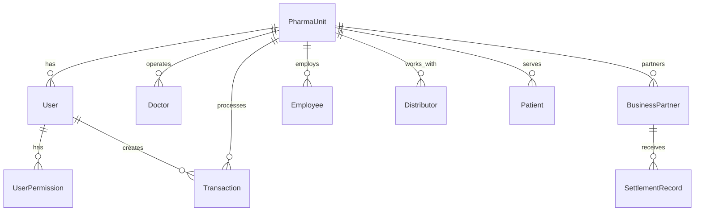

# Database Documentation

## Overview

This section contains comprehensive documentation for the QB Pharma database schema, including entity relationships, migration procedures, and optimization guidelines.

## Documentation Files

- [Schema Overview](./schema.md) - Complete database schema and relationships
- [Migration Guide](./migrations.md) - Database migration procedures and best practices
- [Data Models](./models.md) - Detailed model definitions and constraints
- [Query Optimization](./optimization.md) - Performance optimization techniques
- [Backup & Recovery](./backup-recovery.md) - Database backup and recovery procedures
- [Troubleshooting](./troubleshooting.md) - Common database issues and solutions

## Database Technology

**Database Engine**: SQLite 3.x
**ORM**: Prisma 5.x
**Migration Tool**: Prisma Migrate

## Quick Reference

### Database Location
- **Development**: `backend/prisma/data/qb-pharma.db`
- **Production**: Configurable via `DATABASE_URL` environment variable

### Common Commands

```bash
# Generate Prisma client
npm run db:generate

# Create and apply migration
npm run db:migrate

# Deploy migrations (production)
npm run db:deploy

# Seed database
npm run db:seed

# Open Prisma Studio
npm run db:studio

# Reset database (development only)
npx prisma migrate reset
```

## Schema Overview

### Core Entities

1. **PharmaUnit** - Pharmacy unit/branch management
2. **User** - System users with role-based access
3. **UserPermission** - Granular permissions system
4. **Stakeholders**:
   - Doctor - Medical practitioners
   - BusinessPartner - Business partners with ownership
   - Employee - Staff members
   - Distributor - Suppliers and distributors
   - Patient - Customers
5. **Transaction** - Financial transactions
6. **SettlementRecord** - Partner settlement tracking
7. **Department** - Organizational departments

### Key Relationships



### Data Flow

1. **User Management**: Users belong to PharmaUnits with specific roles and permissions
2. **Stakeholder Management**: All stakeholders are linked to PharmaUnits
3. **Transaction Processing**: Transactions reference stakeholders and are tracked by PharmaUnit
4. **Settlement Processing**: Business partners receive settlements based on ownership percentages

## Performance Considerations

### Indexing Strategy
- Primary keys (auto-indexed by SQLite)
- Foreign key relationships
- Frequently searched fields (email, phone, name)
- Date fields for time-based queries

### Query Optimization
- Use pagination for large result sets
- Include necessary relations only
- Implement proper WHERE clauses
- Use database-level aggregations

### Storage Optimization
- Regular database maintenance
- Proper data archiving strategy
- Optimize text field sizes
- Use appropriate data types

## Security Features

### Data Protection
- No sensitive data in plain text
- Password hashing with bcrypt
- JWT token-based authentication
- Role-based data access

### Access Control
- PharmaUnit-level data isolation
- User permission system
- Audit trail through created_by fields
- Soft deletes where appropriate

## Backup Strategy

### Development
- Manual backups before major changes
- Git version control for schema changes
- Local backup scripts

### Production
- Automated daily backups
- Point-in-time recovery capability
- Offsite backup storage
- Regular backup testing

## Migration Strategy

### Development Workflow
1. Modify schema in `schema.prisma`
2. Create migration: `npx prisma migrate dev`
3. Test migration locally
4. Commit migration files to version control

### Production Deployment
1. Review migration in staging
2. Schedule maintenance window
3. Backup production database
4. Deploy migration: `npx prisma migrate deploy`
5. Verify deployment success

## Troubleshooting

### Common Issues
- Database locked errors
- Migration conflicts
- Schema sync issues
- Performance problems

### Diagnostic Commands
```bash
# Check database status
npx prisma db pull

# Validate schema
npx prisma validate

# Reset development database
npx prisma migrate reset

# Check migration status
npx prisma migrate status
```

---

*For detailed information, see the specific documentation files in this folder.*