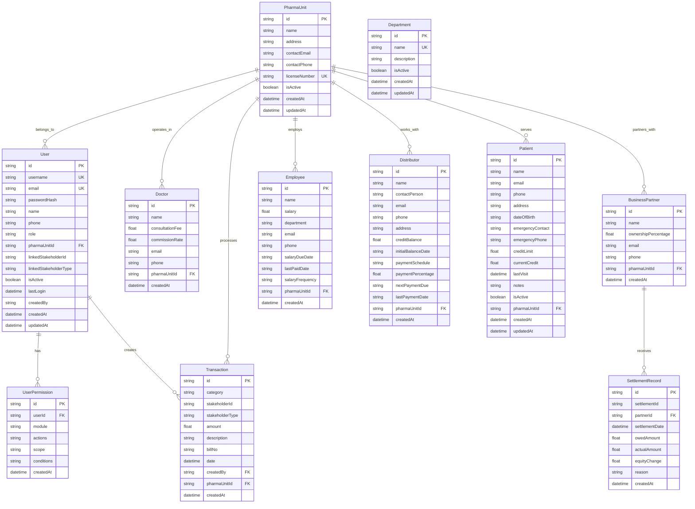

# Database Schema Documentation

## Overview

The QB Pharma database schema is designed to support multi-unit pharmaceutical operations with comprehensive stakeholder management, financial tracking, and role-based access control.

## Entity Relationship Diagram



## Entity Definitions

### PharmaUnit
Represents pharmacy units/branches in the system.

| Column | Type | Constraints | Description |
|--------|------|-------------|-------------|
| id | String | PK, CUID | Unique identifier |
| name | String | Required | Unit name |
| address | String | Required | Physical address |
| contactEmail | String | Required | Contact email |
| contactPhone | String | Required | Contact phone |
| licenseNumber | String | Required, Unique | License number |
| isActive | Boolean | Default: true | Active status |
| createdAt | DateTime | Auto-generated | Creation timestamp |
| updatedAt | DateTime | Auto-updated | Last update timestamp |

**Relationships:**
- Has many Users, Doctors, BusinessPartners, Employees, Distributors, Patients, Transactions

### User
System users with authentication and authorization.

| Column | Type | Constraints | Description |
|--------|------|-------------|-------------|
| id | String | PK, CUID | Unique identifier |
| username | String | Required, Unique | Login username |
| email | String | Required, Unique | Email address |
| passwordHash | String | Required | Bcrypt hashed password |
| name | String | Required | Full name |
| phone | String | Optional | Phone number |
| role | String | Required | User role |
| pharmaUnitId | String | Optional, FK | Associated pharmacy unit |
| linkedStakeholderId | String | Optional | Linked stakeholder ID |
| linkedStakeholderType | String | Optional | Type of linked stakeholder |
| isActive | Boolean | Default: true | Active status |
| lastLogin | DateTime | Optional | Last login timestamp |
| createdBy | String | Optional | Creator user ID |
| createdAt | DateTime | Auto-generated | Creation timestamp |
| updatedAt | DateTime | Auto-updated | Last update timestamp |

**Relationships:**
- Belongs to PharmaUnit
- Has many UserPermissions
- Creates many Transactions

**User Roles:**
- `super_admin` - System administrator
- `admin` - Pharmacy administrator  
- `manager` - Department manager
- `operator` - Data entry operator
- `doctor` - Linked doctor user
- `partner` - Business partner user
- `distributor` - Distributor user

### UserPermission
Granular permission system for users.

| Column | Type | Constraints | Description |
|--------|------|-------------|-------------|
| id | String | PK, CUID | Unique identifier |
| userId | String | Required, FK | User reference |
| module | String | Required | Permission module |
| actions | String | Required | Comma-separated actions |
| scope | String | Required | Permission scope |
| conditions | String | Optional | JSON conditions |
| createdAt | DateTime | Auto-generated | Creation timestamp |

**Permission Modules:**
- `pharma_units` - Pharmacy unit management
- `users` - User management
- `transactions` - Financial transactions
- `stakeholders` - Stakeholder management
- `reports` - Data reports
- `settlements` - Settlement processing
- `dashboard` - Dashboard access
- `system_settings` - System configuration

**Actions:**
- `create` - Create records
- `read` - View data
- `update` - Modify records
- `delete` - Remove records
- `export` - Export data
- `approve` - Approve operations

**Scopes:**
- `all` - All data access
- `own` - Own data only
- `department` - Department data
- `unit` - Pharmacy unit data
- `none` - No access

### Doctor
Medical practitioners providing services.

| Column | Type | Constraints | Description |
|--------|------|-------------|-------------|
| id | String | PK, CUID | Unique identifier |
| name | String | Required | Doctor name |
| consultationFee | Float | Required, Positive | Consultation fee |
| commissionRate | Float | Required, 0-100 | Commission percentage |
| email | String | Required | Email address |
| phone | String | Required | Phone number |
| pharmaUnitId | String | Required, FK | Associated pharmacy unit |
| createdAt | DateTime | Auto-generated | Creation timestamp |

### BusinessPartner
Partners with ownership percentage in the business.

| Column | Type | Constraints | Description |
|--------|------|-------------|-------------|
| id | String | PK, CUID | Unique identifier |
| name | String | Required | Partner name |
| ownershipPercentage | Float | Required, 0-100 | Ownership percentage |
| email | String | Required | Email address |
| phone | String | Required | Phone number |
| pharmaUnitId | String | Required, FK | Associated pharmacy unit |
| createdAt | DateTime | Auto-generated | Creation timestamp |

**Relationships:**
- Has many SettlementRecords

### Employee
Staff members with salary information.

| Column | Type | Constraints | Description |
|--------|------|-------------|-------------|
| id | String | PK, CUID | Unique identifier |
| name | String | Required | Employee name |
| salary | Float | Required, Positive | Monthly salary |
| department | String | Required | Department name |
| email | String | Required | Email address |
| phone | String | Required | Phone number |
| salaryDueDate | String | Required, YYYY-MM-DD | Next salary due date |
| lastPaidDate | String | Optional, YYYY-MM-DD | Last payment date |
| salaryFrequency | String | Default: "monthly" | Payment frequency |
| pharmaUnitId | String | Required, FK | Associated pharmacy unit |
| createdAt | DateTime | Auto-generated | Creation timestamp |

**Salary Frequencies:**
- `monthly` - Monthly payment
- `bi_weekly` - Bi-weekly payment
- `weekly` - Weekly payment

### Distributor
Suppliers and distributors with credit tracking.

| Column | Type | Constraints | Description |
|--------|------|-------------|-------------|
| id | String | PK, CUID | Unique identifier |
| name | String | Required | Distributor name |
| contactPerson | String | Required | Contact person |
| email | String | Required | Email address |
| phone | String | Required | Phone number |
| address | String | Required | Address |
| creditBalance | Float | Default: 0 | Current credit balance |
| initialBalanceDate | String | Optional, YYYY-MM-DD | Initial balance date |
| paymentSchedule | String | Required | Payment frequency |
| paymentPercentage | Float | Required, 0-100 | Payment percentage |
| nextPaymentDue | String | Required, YYYY-MM-DD | Next payment date |
| lastPaymentDate | String | Optional, YYYY-MM-DD | Last payment date |
| pharmaUnitId | String | Required, FK | Associated pharmacy unit |
| createdAt | DateTime | Auto-generated | Creation timestamp |

**Payment Schedules:**
- `weekly` - Weekly payments
- `bi_weekly` - Bi-weekly payments
- `monthly` - Monthly payments

### Patient
Customers with credit limits and medical information.

| Column | Type | Constraints | Description |
|--------|------|-------------|-------------|
| id | String | PK, CUID | Unique identifier |
| name | String | Required | Patient name |
| email | String | Optional | Email address |
| phone | String | Required | Phone number |
| address | String | Optional | Home address |
| dateOfBirth | String | Optional, YYYY-MM-DD | Date of birth |
| emergencyContact | String | Optional | Emergency contact name |
| emergencyPhone | String | Optional | Emergency phone |
| creditLimit | Float | Default: 0 | Credit limit |
| currentCredit | Float | Default: 0 | Current credit balance |
| lastVisit | DateTime | Optional | Last visit date |
| notes | String | Optional | Medical notes |
| isActive | Boolean | Default: true | Active status |
| pharmaUnitId | String | Required, FK | Associated pharmacy unit |
| createdAt | DateTime | Auto-generated | Creation timestamp |
| updatedAt | DateTime | Auto-updated | Last update timestamp |

### Transaction
Financial transactions in the system.

| Column | Type | Constraints | Description |
|--------|------|-------------|-------------|
| id | String | PK, CUID | Unique identifier |
| category | String | Required | Transaction category |
| stakeholderId | String | Optional | Related stakeholder ID |
| stakeholderType | String | Optional | Type of stakeholder |
| amount | Float | Required | Transaction amount |
| description | String | Required | Description |
| billNo | String | Optional | Bill/receipt number |
| date | DateTime | Required | Transaction date |
| createdBy | String | Required, FK | Creator user ID |
| pharmaUnitId | String | Required, FK | Associated pharmacy unit |
| createdAt | DateTime | Auto-generated | Creation timestamp |

**Transaction Categories:**
- `pharmacy_sale` - Pharmacy sales
- `consultation_fee` - Doctor consultation fees
- `distributor_payment` - Payments to distributors
- `distributor_credit_purchase` - Credit purchases from distributors
- `distributor_credit_note` - Credit notes to distributors
- `doctor_expense` - Doctor-related expenses
- `sales_profit_distribution` - Profit distribution to partners
- `employee_payment` - Employee salary payments
- `clinic_expense` - Clinic operational expenses
- `patient_credit_sale` - Credit sales to patients
- `patient_payment` - Payments from patients
- `settlement_point` - Settlement point markers

**Stakeholder Types:**
- `doctor` - Doctor stakeholder
- `business_partner` - Business partner
- `employee` - Employee
- `distributor` - Distributor
- `patient` - Patient

### SettlementRecord
Tracks settlement payments to business partners.

| Column | Type | Constraints | Description |
|--------|------|-------------|-------------|
| id | String | PK, CUID | Unique identifier |
| settlementId | String | Required | Settlement batch ID |
| partnerId | String | Required, FK | Business partner ID |
| settlementDate | DateTime | Required | Settlement date |
| owedAmount | Float | Required | Amount owed |
| actualAmount | Float | Required | Amount actually paid |
| equityChange | Float | Required | Equity adjustment |
| reason | String | Optional | Reason for difference |
| createdAt | DateTime | Auto-generated | Creation timestamp |

### Department
Organizational departments for categorization.

| Column | Type | Constraints | Description |
|--------|------|-------------|-------------|
| id | String | PK, CUID | Unique identifier |
| name | String | Required, Unique | Department name |
| description | String | Optional | Description |
| isActive | Boolean | Default: true | Active status |
| createdAt | DateTime | Auto-generated | Creation timestamp |
| updatedAt | DateTime | Auto-updated | Last update timestamp |

## Database Constraints

### Primary Keys
All entities use CUID (Collision-resistant Unique Identifier) as primary keys for better distribution and uniqueness.

### Foreign Key Relationships
- User → PharmaUnit (pharmaUnitId)
- UserPermission → User (userId)
- Doctor → PharmaUnit (pharmaUnitId)
- BusinessPartner → PharmaUnit (pharmaUnitId)
- Employee → PharmaUnit (pharmaUnitId)
- Distributor → PharmaUnit (pharmaUnitId)
- Patient → PharmaUnit (pharmaUnitId)
- Transaction → User (createdBy)
- Transaction → PharmaUnit (pharmaUnitId)
- SettlementRecord → BusinessPartner (partnerId)

### Unique Constraints
- User.username (unique across system)
- User.email (unique across system)
- PharmaUnit.licenseNumber (unique license numbers)
- Department.name (unique department names)

### Data Validation
- Email fields use email format validation
- Phone fields require minimum length
- Numeric fields have appropriate min/max constraints
- Date fields use YYYY-MM-DD string format
- Percentage fields are constrained to 0-100 range

## Indexing Strategy

### Primary Indexes
- All primary keys are automatically indexed by SQLite

### Secondary Indexes (Recommended)
```sql
-- User lookups
CREATE INDEX idx_users_username ON users(username);
CREATE INDEX idx_users_email ON users(email);
CREATE INDEX idx_users_pharma_unit ON users(pharmaUnitId);

-- Stakeholder searches
CREATE INDEX idx_doctors_email ON doctors(email);
CREATE INDEX idx_patients_phone ON patients(phone);
CREATE INDEX idx_distributors_name ON distributors(name);

-- Transaction queries
CREATE INDEX idx_transactions_date ON transactions(date);
CREATE INDEX idx_transactions_category ON transactions(category);
CREATE INDEX idx_transactions_stakeholder ON transactions(stakeholderId);

-- Permission lookups
CREATE INDEX idx_permissions_user ON user_permissions(userId);
CREATE INDEX idx_permissions_module ON user_permissions(module);
```

## Schema Evolution

### Migration Strategy
1. **Development**: Use `prisma migrate dev` for schema changes
2. **Production**: Use `prisma migrate deploy` for deployment
3. **Rollback**: Maintain rollback migration files
4. **Testing**: Test migrations in staging environment

### Versioning
- Schema version tracked through Prisma migration system
- Each migration has unique timestamp identifier
- Migration history stored in `_prisma_migrations` table

## Performance Considerations

### Query Optimization
- Use SELECT with specific fields instead of SELECT *
- Implement proper WHERE clauses for filtering
- Use database-level JOINs instead of application-level joins
- Implement pagination for large result sets

### Storage Optimization
- Use appropriate field sizes for text columns
- Consider archiving old transaction data
- Implement soft deletes where data retention is required
- Regular database maintenance and optimization

---

This schema supports the complete pharmaceutical management workflow while maintaining data integrity and performance.